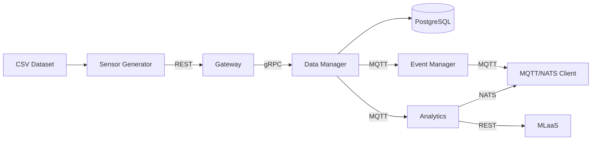

## System Architecture



## Projct I - Gateway and DataManager

### Gateway
**Gateway** is a microservice that exposes all public endpoints for interacting with **DataManager**. It provides basic CRUD operations and aggregation functionality, serving as the entry point for data ingestion and queries.

## DataManager
**DataManager** is a microservice responsible for database access and persistence. It communicates with the **Gateway via gRPC** and encapsulates all logic related to storing and retrieving data from the database.

## SensorGenerator
**SensorGenerator** is a client that reads data from a predefined dataset and sends it to the system through the **Gateway**, simulating real-time sensor data ingestion.

## Project II - MQTT

### DataManager
DataManager from the first phase should be expanded so it should send messages to a `datamanager-reading` topic of MQTT message broker.

**DataManager** is extended from Phase I of the project. In this phase, it publishes sensor readings to the MQTT message broker on the `datamanager-readings` topic. 

### EventManager
**EventManager** is a microservice that is subscribed to a `datamanger-reading` topic of the MQTT and if it detects data that is anomaly in defined scope it should send it to the `eventmanager-anomaly`.

**EventManager** is a microservice subscribed to the `datamanager-readings` MQTT topic. It evaluates incoming data against a predefined threshold, and if anomaly is detected, the data is published to the `eventmanager-anomalies` topic for further processing.

## MqttClient
**MqttClient** subscribes to the `eventmanager-anomalies` topic on the MQTT message broker. Its responsibility is to receive anomaly events detected by the **EventManager**.

## Project III - MLaaS and NATS

### MLaaS
**MLaaS** is a microservice used to train model on incoming data and predict future values based on historical measurments.

#### Tech Stack
⚙️ **Language:** Python  

🛠 **Web Framework:** FastAPI  

📊 **ML / Data:** scikit-learn, pandas, numpy  

💾 **Model Serialization:** joblib  

#### Endpoints
- **GET /** – Root endpoint. Can be used to check if the service is running.  
- **POST /predict/** – Accepts recent historical data and returns predicted future values from the trained ML model.

#### Development
1. Make sure all dependencies are installed 
```bash
pip install -r requirements.txt
```

2. Run the service in development mode:
```
uvicorn main:app --reload
```

3. Open Swagger UI to explore and test endpoints easily:
```
http://{address}:{port}/docs
```

### Analytics
**Analytics** is a microservice similar to other in the app. It subscribes to a **topic** where **DataManager** sends data, uses the **MLaaS** REST endpoint to generate predictions, and publishes the result to another **NATS** subject `analytics-prediction`.

### MqttNatsClient
This client is an extension of Phase II of the project. Previously, it only received MQTT messages, but now it also subscribes to the `analytics-prediction` subject on the NATS message broker to receive messages from the **Analytics** microservice.

# Other
- [Kaggle - Smart Home Dataset With Weather Information](https://www.kaggle.com/datasets/taranvee/smart-home-dataset-with-weather-information)
